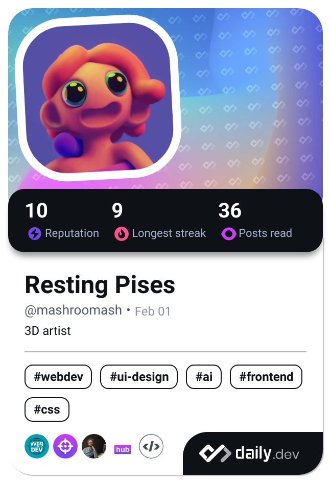

I just LOVE widgets (I'll clean it up later) 

  

<a target="_blank" href="https://github-readme-medium-recent-article.vercel.app/medium/@whathellis/0"> 

<a target="_blank" href="https://github-readme-medium-recent-article.vercel.app/medium/@whathellis/2"> 

<!---whathellis/whathellis is a ✨ special ✨ repository because its `README.md` (this file) appears on your GitHub profile.You can click the Preview link to take a look at your changes.--->

 
